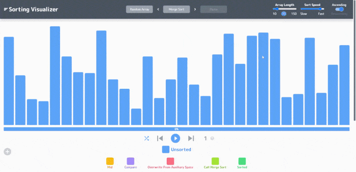
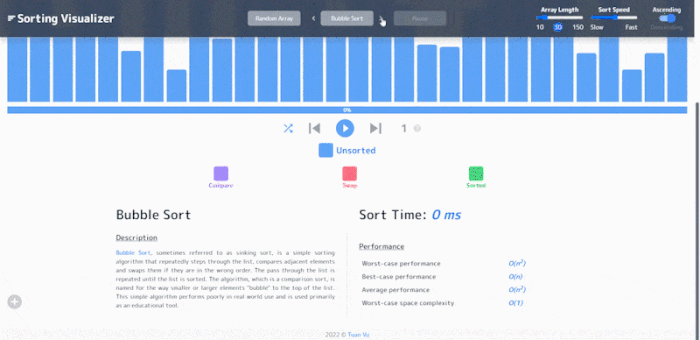
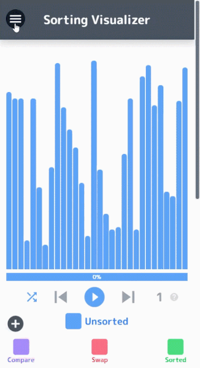
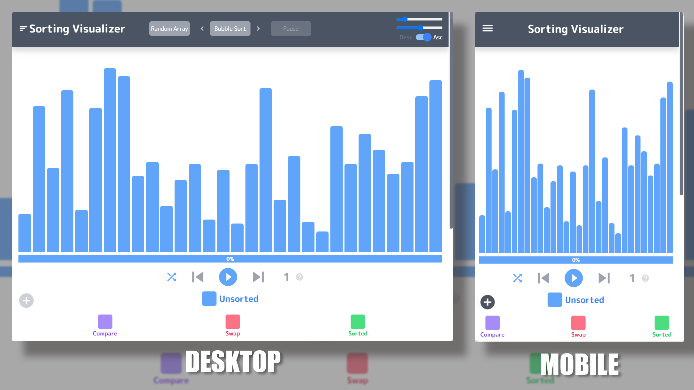

# Sorting Visualizer

Try the demo on [vuquangtuan123.github.io/sorting-visualizer](https://vuquangtuan123.github.io/sorting-visualizer)

## Demo







## Built With

- [ReactJS](https://reactjs.org/)
- [React Transition Group](https://reactcommunity.org/react-transition-group/)
- [Tailwind CSS](https://tailwindcss.com/)
- [Tailwind Custom Form](https://tailwindcss-custom-forms.netlify.app/)

## Responsive design



## Project structure

```
$PROJECT_ROOT
├── public                 # index.html
└── src
    ├── components         # UI components
    ├── hook               # custom hook
    ├── utils              # utility
    └── sorting-algorithms # algorithms
```

## Run the app

```sh
yarn install
yarn start
```

---
